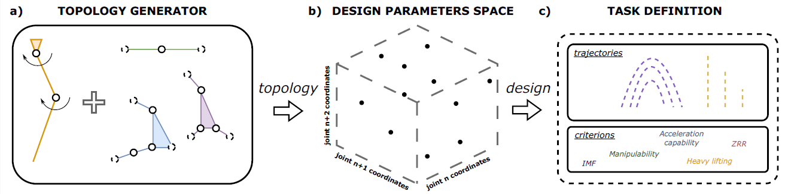

# Computational Design of Closed Linkages For Robotic Limbs

This is the implementation of the framework presented in our paper for IROS 2025. 

This study presents a framework for computational design of closed kinematic chains for robotic limbs. The proposed framework employs numerical computations, optimization algorithms, and kinetostatic criteria to explore optimal configurations by tailoring the link lengths
to specific kinematic structures. Moving beyond symmetric parallel chain designs, the framework enables exploration and optimization of asymmetric configurations that do not have analytical inverse kinematic solutions. The optimization process focuses on kinetostatic criteria, independent of specific control algorithms or velocity profiles, ensuring a broader applicability. 

## Env setup with conda 

* Use environment.yml to create the conda environment with all necessary dependencies:
` conda env create -f environment.yml `

* activate the environment:  
`conda activate jmoves`

* install the library on developers mode:  
  `pip install -e . `

## Example

An example of the optimization is in `apps\optimization.ipynb`. It describes all the steps that should be done to start the optimization process:
* Set the topology building rules
* Create trajectories and rewards for the optimization
* Set builder parameters
* Set the optimization task and algorithm

### Our command

* Mikhail Chaikovskii - researcher/developer
* Yefim Osipov-Sigachev - researcher/developer
* Kirill Zharkov - researcher/developer
* Ivan Borisov - researcher
* Sergey Kolyubin - chief scientist
